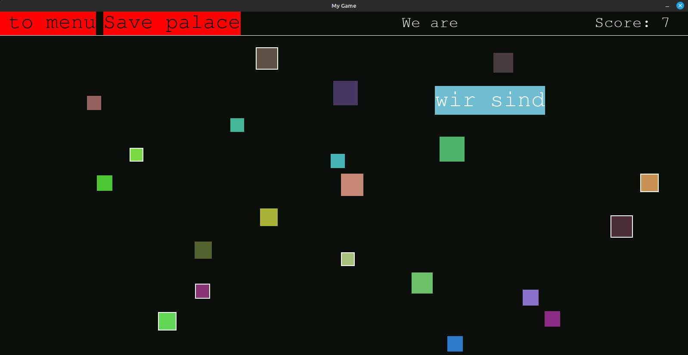

# Word Palace

Learn vocabulary easily! 

Remember patterns between words. Each word gets assigned a random location on the screen, and a random color, also a random size. Then the program will teach you to remember the words based on those generated values. 

## How to run
1. This project was built on `Python 3.12.5`
2. Make sure you have `pygame` installed. 
3. Create your own wordlist into the `wordlists/` folder with the file extension of `.wl`. 
4. Then run: `python main.py` to run the program
5. Navigate the menu to generate a "palace" out of an existing wordlist
6. Then restart the program and navigate to the "Choose Palace" menu
7. Open your generated palace and enjoy learning :) 
